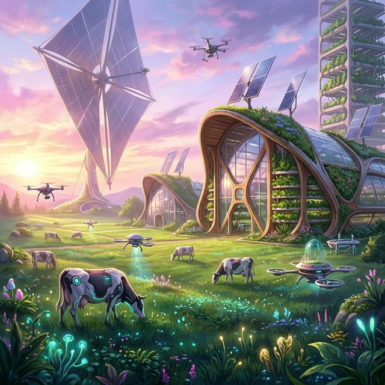
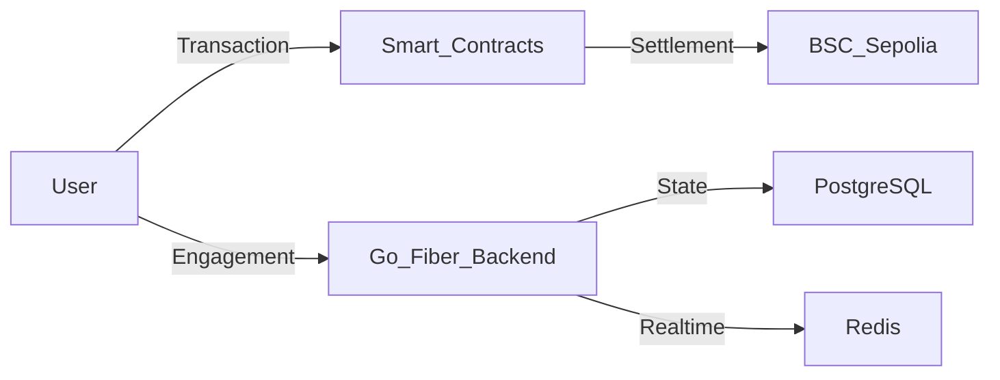
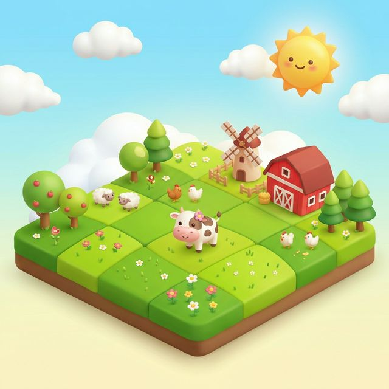

# 🐮 Cash Cow Valley
**The Premier Grass-Fed Web3 Yield Protocol & Farming Simulator**



[](https://opensource.org/licenses/MIT)
[](https://nextjs.org/)
[](https://gofiber.io/)
[](#-gameplay-loop-web2-vs-web3)

---

## 📖 Overview
**Cash Cow Valley** is an immersive agricultural simulator merged with advanced DeFi mechanics. Inspired by the pioneers of Web3 gaming, we've built a world where players own, manage, and scale digital farming operations to generate sustainable real-world yield.

Unlike traditional P2E models, Cash Cow Valley utilizes a **Dual-Economy Protocol**:
1.  **Web2 Active Loop**: High-engagement farming mechanics (Care-to-Harvest).
2.  **Web3 Passive Loop**: Professional-grade NFT staking for institutional-style yield.

---

## 🎮 Gameplay Loop: Web2 vs Web3

### 🌾 Standard Farming (Active Web2)
*For the dedicated ranchers.* Standard cows live off-chain for rapid, gasless gameplay.
- **Adopt & Care**: Acquiring cows is just the start. Every cow needs daily care.
- **Vitamin Protocol**: Players must feed cows or provide "Vitamin Premiums" (earned via engagement).
- **Yield Penalty**: Failure to care for your herd results in **Zero Yield**. Consistency is key to profit.

### 🏆 Golden Staking (Passive Web3)
*For the DeFi Elite.* Golden Cow NFTs are premium assets that bypass the daily care requirement.
- **Tiered Assets**: From Baby Golden Cows to the massive Golden Cow Ranch.
- **Dual Staking Modes**:
    - **Flexible Pool**: No fees, proportional share of daily emissions.
    - **Premium Locked**: 100-day contract with **guaranteed fixed daily yield**.

---

## 🪙 Economic Engine

### Tokenomics & Allocation
The `$COW` token is designed with long-term scarcity in mind.

| Allocation | Share | Logic |
| :--- | :--- | :--- |
| **Liquidity & DEX** | `50%` | Permanent lock to ensure trading stability. |
| **Farming Rewards** | `40%` | Emitted only to active, successful farmers. |
| **Team & Dev** | `10%` | 24-month linear vest to align incentives. |

### The Treasury Splitter (70/20/10)
Every purchase on the platform powers the ecosystem:
- **70% LP Buyback**: Automated price support and liquidity deepening.
- **20% Referral**: Instant payout to the inviter network.
- **10% Dev & Scale**: Funding for infrastructure and new feature development.

---

## 🛡️ Technical Architecture

Built with a performance-first "Digital Vanguard" aesthetic and a robust micro-service architecture.



-   **Frontend**: Next.js 14, Framer Motion, Tailwind CSS (AAA Grade UI).
-   **Web3**: Wagmi + Web3Modal (Sepolia & BNB Smart Chain Support).
-   **Backend**: Go (Fiber) - High-concurrency engine for off-chain state.
-   **Storage**: PostgreSQL (Global State) & Redis (Real-time caching & rate-limiting).

---

## 🚀 Getting Started

### Prerequisites
- **Node.js** v18+ 
- **Go** v1.21+
- **PostgreSQL** & **Redis**

### Installation

1. **Clone & Install Frontend**
   ```bash
   cd frontend
   npm install
   npm run dev
   ```

2. **Initialize Backend**
   ```bash
   cd backend
   go mod download
   go run main.go
   ```

3. **Deploy Contracts**
   ```bash
   # Use Hardhat or Foundry to deploy to Sepolia/BSC
   npx hardhat run scripts/deploy.js --network sepolia
   ```

---

## 🖼️ Preview
<p align="center">
  
  
</p>

---

<div align="center">
  <sub>Developed by Antigravity for the Cash Cow Valley Protocol.</sub>
</div>

